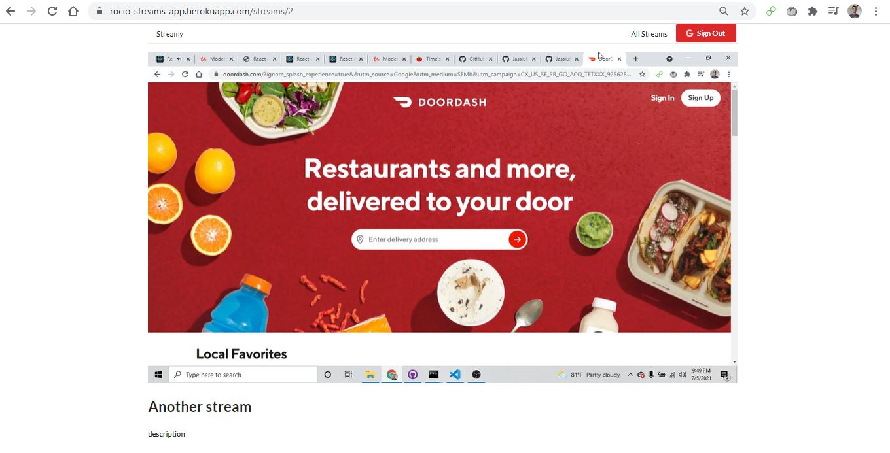
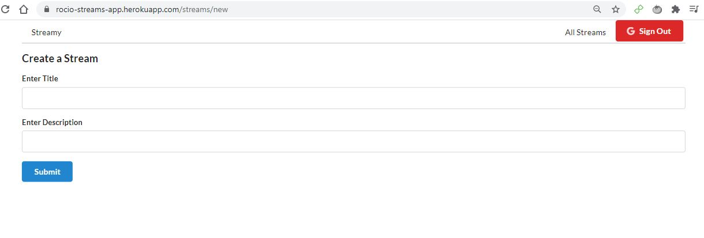
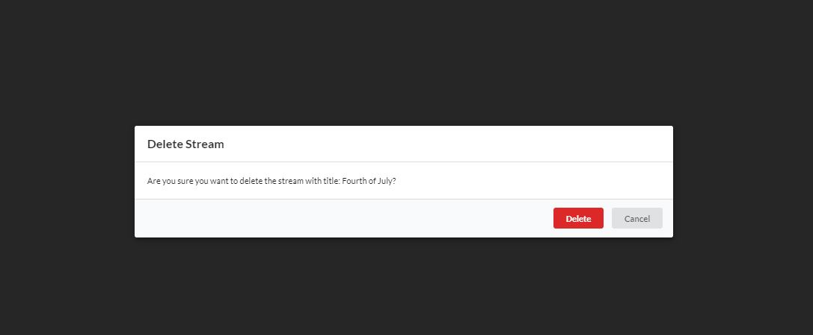
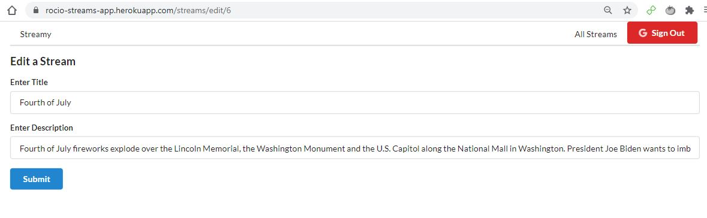
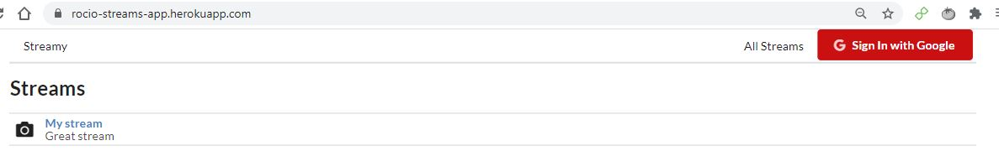

# Streamify

A React app that lets user upload livestreams for other users to view.

Live Link:
https://rocio-streams-app.herokuapp.com/

Instructions to broadcast your screen via your channel:

1.  do npm start in all 3 folders api, client and rtmp
2.  Open OBS
3.  Click settings on right bottom. Now, open Stream.
4.  Select custom
5.  Go to Homepage, login and open a stream. It will have a url like /streams/2
6.  This 2 is the id that we need.
7.  In OBS, type in server "rtmp://localhost/live"
8.  Give Id = 2
9.  Now click ok, go back and click start recording.
10. Refresh the screen on frontend. After a lag of 5-10 seconds the player will broadcast the live stream on the internet

### Watching a live Stream

### Create Route

### Deleting a stream

### Editing a stream

### Google OAuth

